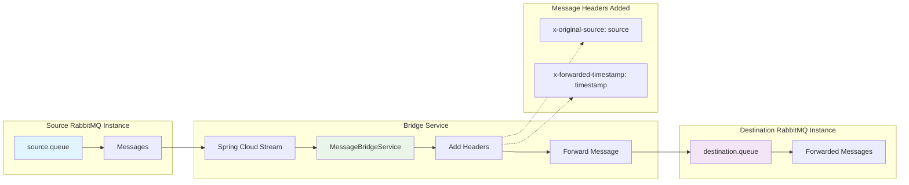

# Spring Cloud Stream Message Bridge Service

A professional-grade Spring Cloud Stream service that bridges messages between two separate RabbitMQ instances using Java 21, providing reliable message forwarding without modification.

## 🏗️ Architecture Overview



## ✨ Features

- **🔗 Multi-RabbitMQ Bridge**: Connects two separate RabbitMQ instances
- **🚀 Java 21**: Built with modern Java LTS features and performance improvements
- **⚡ Zero Message Modification**: Messages forwarded exactly as received
- **📊 Header Enrichment**: Adds traceability headers without modifying payload
- **🛡️ Reliable Processing**: Built-in retry logic and error handling
- **📈 Production Ready**: Comprehensive monitoring and health checks
- **🐳 Docker Native**: Fully containerized with Docker Compose
- **🧪 Test Coverage**: Unit and integration tests with Testcontainers
- **🔍 Observability**: Actuator endpoints for monitoring and metrics

## 🛠️ Technology Stack

- **Java 21** - Modern LTS JDK with enhanced performance
- **Spring Boot 3.3.5** - Modern Spring framework
- **Spring Cloud Stream** - Message-driven microservices
- **Gradle 8.8** - Build automation
- **RabbitMQ 3.12** - Message broker with management UI
- **Docker & Docker Compose** - Containerization
- **Testcontainers** - Integration testing
- **Spring Boot Actuator** - Production monitoring

## 📋 Prerequisites

- **Java 21** - Required for compilation and runtime
- **Docker & Docker Compose** - For RabbitMQ instances and containerization
- **Gradle 8.8+** - Included via wrapper

## 🚀 Quick Start

### 1. Clone and Navigate
```bash
git clone <repository-url>
cd spring-cloud-stream-service
```

### 2. Start Infrastructure
```bash
# Start both RabbitMQ instances
docker-compose up -d rabbitmq-source rabbitmq-destination

# Verify health
docker-compose ps
```

### 3. Run the Bridge Service

**Option A: Local Development**
```bash
# Build and test
./gradlew build

# Run locally
./gradlew bootRun
```

**Option B: Full Docker Environment**
```bash
# Build and start everything
docker-compose up --build
```

### 4. Test Message Flow
```bash
# Start message publisher
docker-compose run --rm message-publisher

# In the publisher terminal:
> msg Hello from source RabbitMQ!
> auto
> quit
```

## 🔧 Configuration

### Environment Variables

| Variable | Default | Description |
|----------|---------|-------------|
| `RABBITMQ_SOURCE_HOST` | localhost | Source RabbitMQ hostname |
| `RABBITMQ_SOURCE_PORT` | 5672 | Source RabbitMQ AMQP port |
| `RABBITMQ_SOURCE_USER` | admin | Source RabbitMQ username |
| `RABBITMQ_SOURCE_PASSWORD` | admin123 | Source RabbitMQ password |
| `RABBITMQ_SOURCE_VHOST` | / | Source RabbitMQ virtual host |
| `RABBITMQ_DESTINATION_HOST` | localhost | Destination RabbitMQ hostname |
| `RABBITMQ_DESTINATION_PORT` | 5673 | Destination RabbitMQ AMQP port |
| `RABBITMQ_DESTINATION_USER` | admin | Destination RabbitMQ username |
| `RABBITMQ_DESTINATION_PASSWORD` | admin123 | Destination RabbitMQ password |
| `RABBITMQ_DESTINATION_VHOST` | / | Destination RabbitMQ virtual host |
| `SERVER_PORT` | 8080 | Application server port |

### Application Profiles

- **`default`** - Local development with localhost RabbitMQ instances
- **`docker`** - Docker environment with containerized RabbitMQ instances  
- **`test`** - Testing with embedded test binder

### Message Processing Configuration

```yaml
spring:
  cloud:
    stream:
      bindings:
        sourceInput:
          consumer:
            max-attempts: 3              # Retry failed messages 3 times
            back-off-initial-interval: 1000  # 1 second initial backoff
            back-off-multiplier: 2.0     # Exponential backoff
        destinationOutput:
          producer:
            required-groups: destination-group  # Ensure queue exists
```

## 📊 Monitoring & Management

### Health Checks
- **Application**: http://localhost:8080/actuator/health
- **Metrics**: http://localhost:8080/actuator/metrics
- **Info**: http://localhost:8080/actuator/info

### RabbitMQ Management UIs
- **Source Instance**: http://localhost:15672 (admin/admin123)
- **Destination Instance**: http://localhost:15673 (admin/admin123)

### Key Metrics to Monitor
- Message processing rates
- Queue depths
- Connection status
- Error rates
- Processing latency

## 🧪 Development & Testing

### Running Tests
```bash
# Unit tests only
./gradlew test

# Integration tests with Testcontainers (requires Docker)
./gradlew integrationTest

# All tests (unit + integration) 
./gradlew allTests

# Quick test runner script
./run-tests.sh [unit|integration|all|e2e|quick|help]

# Run specific test types
./run-tests.sh unit        # Unit tests only
./run-tests.sh integration # Integration tests with Docker
./run-tests.sh e2e         # End-to-end tests only
./run-tests.sh all         # All tests
./run-tests.sh quick       # Quick validation (unit + build)
```

### Test Architecture

#### Unit Tests
- **MessageBridgeServiceTest**: Direct testing of message processing logic
- **Fast execution**: No external dependencies
- **Coverage**: Message transformation, header enrichment, error handling

#### Integration Tests  
- **MessageBridgeIntegrationTest**: Spring context loading with RabbitMQ
- **MessageBridgeEndToEndTest**: Complete message flow validation
- **Real RabbitMQ**: Uses Testcontainers with separate source/destination instances
- **Full validation**: Message publishing → processing → consumption verification

#### End-to-End Test Features
- ✅ **Simple Text Messages**: Basic message forwarding
- ✅ **JSON Payloads**: Complex object serialization/deserialization  
- ✅ **Header Preservation**: Original headers maintained, bridge headers added
- ✅ **Batch Processing**: Multiple message handling
- ✅ **Error Scenarios**: Connection failures and recovery
- ✅ **Performance**: Message throughput and latency validation

### Local Development Workflow

1. **Start RabbitMQ instances**:
   ```bash
   docker-compose up -d rabbitmq-source rabbitmq-destination
   ```

2. **Run application locally**:
   ```bash
   ./gradlew bootRun
   ```

3. **Monitor logs**:
   ```bash
   # Application logs show message processing
   tail -f logs/spring.log
   ```

4. **Test message flow**:
   ```bash
   # Use the publisher utility
   docker-compose run --rm message-publisher
   ```

### Code Structure
```
src/
├── main/java/com/example/messagebridge/
│   ├── MessageBridgeApplication.java          # Main application class
│   ├── config/StreamConfig.java               # Stream bindings configuration
│   └── service/MessageBridgeService.java     # Core message processing logic
├── main/resources/
│   ├── application.yml                        # Main configuration
│   └── application-docker.yml                # Docker-specific config
└── test/java/com/example/messagebridge/
    ├── MessageBridgeApplicationTest.java      # Integration tests
    ├── service/MessageBridgeServiceTest.java  # Unit tests
    └── integration/                           # Testcontainer tests
```

## 🐳 Docker Deployment

### Production Deployment
```bash
# Build optimized image
docker build -t message-bridge-service:latest .

# Deploy with production configuration
docker-compose -f docker-compose.yml -f docker-compose.prod.yml up -d
```

### Scaling Considerations
- **Horizontal Scaling**: Run multiple instances for higher throughput
- **Resource Limits**: Configure memory and CPU limits in production
- **Queue Configuration**: Adjust prefetch and consumer settings based on load
- **Connection Pooling**: Monitor and tune RabbitMQ connection pools

## 📈 Message Flow Analysis

### Message Processing Pipeline
1. **Source Consumption**: Spring Cloud Stream consumes from `source.queue`
2. **Header Enrichment**: Adds tracking headers (`x-original-source`, `x-forwarded-timestamp`)
3. **Payload Preservation**: Original message body remains unchanged
4. **Destination Publishing**: Forwards enriched message to `destination.queue`
5. **Error Handling**: Automatic retries with exponential backoff

### Performance Characteristics
- **Throughput**: Depends on RabbitMQ configuration and network latency
- **Latency**: Minimal processing overhead (~1-5ms per message)
- **Reliability**: At-least-once delivery semantics with retry logic
- **Scalability**: Horizontally scalable with multiple service instances

## 🔍 Troubleshooting Guide

### Common Issues

**Service Won't Start**
```bash
# Check RabbitMQ instances
docker-compose ps

# Verify health
docker-compose logs rabbitmq-source rabbitmq-destination

# Check service logs
docker-compose logs message-bridge-service
```

**Messages Not Processing**
- Verify queues exist in RabbitMQ Management UIs
- Check connection credentials and network connectivity
- Review binder configurations in `application.yml`
- Monitor consumer lag in RabbitMQ management interface

**High Memory Usage**
- Adjust JVM heap settings: `-Xmx512m -Xms256m`
- Review prefetch settings to prevent message accumulation
- Monitor garbage collection metrics

**Network Connectivity Issues**
```bash
# Test RabbitMQ connectivity
telnet localhost 5672  # Source
telnet localhost 5673  # Destination

# Check Docker network
docker network ls
docker network inspect message-bridge-network
```

### Debug Mode
```bash
# Enable debug logging
export LOGGING_LEVEL_COM_EXAMPLE_MESSAGEBRIDGE=DEBUG
./gradlew bootRun
```

## 🤝 Contributing

1. Fork the repository
2. Create a feature branch: `git checkout -b feature/new-feature`
3. Commit changes: `git commit -am 'Add new feature'`
4. Push to branch: `git push origin feature/new-feature`
5. Submit a Pull Request

### Development Guidelines
- Follow Java coding standards
- Add tests for new features
- Update documentation for API changes
- Ensure Docker builds succeed
- Verify integration tests pass

## 📝 License

This project is licensed under the MIT License - see the [LICENSE](LICENSE) file for details.

## 🏷️ Version Information

- **Java**: 21
- **Spring Boot**: 3.3.5  
- **Spring Cloud**: 2023.0.3
- **Gradle**: 8.8+
- **Docker Compose**: 3.8