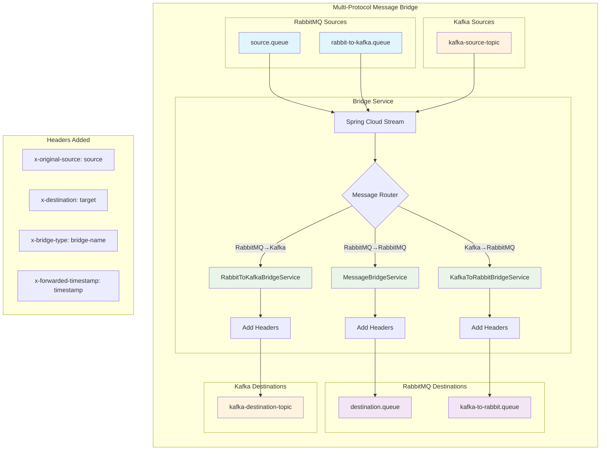

# Spring Cloud Stream Multi-Protocol Message Bridge Service

A professional-grade Spring Cloud Stream service that bridges messages between different messaging systems (RabbitMQ and Kafka) using Java 24, providing reliable cross-protocol message forwarding without modification. Supports bidirectional message flow: RabbitMQ ↔ RabbitMQ, RabbitMQ → Kafka, and Kafka → RabbitMQ.

## 🏗️ Architecture Overview



## ✨ Features

### Multi-Protocol Bridge Support
- **🔗 RabbitMQ → RabbitMQ**: Original bridge functionality between separate RabbitMQ instances
- **🚀 RabbitMQ → Kafka**: Cross-protocol bridging from RabbitMQ to Kafka topics
- **⚡ Kafka → RabbitMQ**: Cross-protocol bridging from Kafka topics to RabbitMQ queues
- **🔄 Bidirectional Flow**: Complete multi-protocol message forwarding capabilities

### Technical Excellence
- **☕ Java 24**: Built with modern Java features and performance improvements
- **📦 Zero Message Modification**: Messages forwarded exactly as received
- **📊 Header Enrichment**: Adds traceability headers (`x-original-source`, `x-destination`, `x-bridge-type`) without modifying payload
- **🛡️ Reliable Processing**: Built-in retry logic and error handling
- **📈 Production Ready**: Comprehensive monitoring and health checks
- **🐳 Docker Native**: Fully containerized with Docker Compose including Kafka and Zookeeper
- **🧪 Test Coverage**: Unit and integration tests with Testcontainers for both RabbitMQ and Kafka
- **🔍 Observability**: Actuator endpoints for monitoring and metrics

## 🛠️ Technology Stack

- **Java 24** - Modern JDK with enhanced performance
- **Spring Boot 3.3.5** - Modern Spring framework
- **Spring Cloud Stream** - Message-driven microservices with multi-binder support
- **Gradle 8.8** - Build automation
- **RabbitMQ 3.12** - AMQP message broker with management UI
- **Apache Kafka** - Distributed streaming platform via Confluent CP 7.4.0
- **Apache Zookeeper** - Kafka coordination service
- **Docker & Docker Compose** - Full containerization with multi-protocol infrastructure
- **Testcontainers** - Integration testing with RabbitMQ and Kafka containers
- **Spring Boot Actuator** - Production monitoring and health checks

## 📋 Prerequisites

- **Java 24** - Required for compilation and runtime
- **Docker & Docker Compose** - For RabbitMQ instances and containerization
- **Gradle 8.8+** - Included via wrapper

## 🚀 Quick Start

### 1. Clone and Navigate
```bash
git clone <repository-url>
cd spring-cloud-stream-service
```

### 2. Start Infrastructure
```bash
# Start all messaging infrastructure (RabbitMQ, Kafka, Zookeeper)
docker-compose up -d rabbitmq-source rabbitmq-destination kafka zookeeper

# Or start specific components
docker-compose up -d rabbitmq-source rabbitmq-destination  # RabbitMQ only
docker-compose up -d kafka zookeeper                        # Kafka only

# Verify health
docker-compose ps
```

### 3. Run the Bridge Service

**Option A: Local Development**
```bash
# Build and test
./gradlew build

# Run locally
./gradlew bootRun
```

**Option B: Full Docker Environment**
```bash
# Build and start everything
docker-compose up --build
```

### 4. Test Message Flow
```bash
# Start message publisher
docker-compose run --rm message-publisher

# In the publisher terminal:
> msg Hello from source RabbitMQ!
> auto
> quit
```

## 🔧 Configuration

### Environment Variables

#### RabbitMQ Configuration
| Variable | Default | Description |
|----------|---------|-------------|
| `RABBITMQ_SOURCE_HOST` | localhost | Source RabbitMQ hostname |
| `RABBITMQ_SOURCE_PORT` | 5672 | Source RabbitMQ AMQP port |
| `RABBITMQ_SOURCE_USER` | guest | Source RabbitMQ username |
| `RABBITMQ_SOURCE_PASSWORD` | guest | Source RabbitMQ password |
| `RABBITMQ_SOURCE_VHOST` | / | Source RabbitMQ virtual host |
| `RABBITMQ_DESTINATION_HOST` | localhost | Destination RabbitMQ hostname |
| `RABBITMQ_DESTINATION_PORT` | 5673 | Destination RabbitMQ AMQP port |
| `RABBITMQ_DESTINATION_USER` | guest | Destination RabbitMQ username |
| `RABBITMQ_DESTINATION_PASSWORD` | guest | Destination RabbitMQ password |
| `RABBITMQ_DESTINATION_VHOST` | / | Destination RabbitMQ virtual host |

#### Kafka Configuration
| Variable | Default | Description |
|----------|---------|-------------|
| `KAFKA_SOURCE_BROKERS` | localhost:9092 | Source Kafka bootstrap servers |
| `KAFKA_DESTINATION_BROKERS` | localhost:9093 | Destination Kafka bootstrap servers |

#### Application Configuration
| Variable | Default | Description |
|----------|---------|-------------|
| `SERVER_PORT` | 8080 | Application server port |

### Application Profiles

- **`default`** - Local development with localhost RabbitMQ and Kafka instances
- **`docker`** - Docker environment with containerized messaging infrastructure  
- **`test`** - Testing with embedded test binder
- **`integration`** - Integration testing with Testcontainers for multi-protocol support

### Message Processing Configuration

```yaml
spring:
  cloud:
    stream:
      bindings:
        sourceInput:
          consumer:
            max-attempts: 3              # Retry failed messages 3 times
            back-off-initial-interval: 1000  # 1 second initial backoff
            back-off-multiplier: 2.0     # Exponential backoff
        destinationOutput:
          producer:
            required-groups: destination-group  # Ensure queue exists
```

## 📊 Monitoring & Management

### Health Checks
- **Application**: http://localhost:8080/actuator/health
- **Metrics**: http://localhost:8080/actuator/metrics
- **Info**: http://localhost:8080/actuator/info

### Messaging System UIs
- **Source RabbitMQ**: http://localhost:15672 (guest/guest)
- **Destination RabbitMQ**: http://localhost:15673 (guest/guest)
- **Kafka**: Use `kafka-topics`, `kafka-console-producer`, `kafka-console-consumer` CLI tools or external UI tools

### Key Metrics to Monitor
- Message processing rates across all bridge types
- RabbitMQ queue depths and Kafka topic lag
- Connection status for both RabbitMQ and Kafka
- Cross-protocol bridge success/error rates
- Processing latency for different message types
- Consumer group health (Kafka)
- Exchange/queue bindings (RabbitMQ)

## 🧪 Development & Testing

### Running Tests
```bash
# Unit tests only
./gradlew test

# Integration tests with Testcontainers (requires Docker)
./gradlew integrationTest

# All tests (unit + integration) 
./gradlew allTests

# Quick test runner script
./run-tests.sh [unit|integration|all|e2e|quick|help]

# Run specific test types
./run-tests.sh unit        # Unit tests only
./run-tests.sh integration # Integration tests with Docker
./run-tests.sh e2e         # End-to-end tests only
./run-tests.sh all         # All tests
./run-tests.sh quick       # Quick validation (unit + build)
```

### Test Architecture

#### Unit Tests
- **MessageBridgeServiceTest**: Direct testing of original RabbitMQ→RabbitMQ message processing logic
- **RabbitToKafkaBridgeServiceTest**: Testing RabbitMQ→Kafka bridge functionality
- **KafkaToRabbitBridgeServiceTest**: Testing Kafka→RabbitMQ bridge functionality  
- **Fast execution**: No external dependencies
- **Coverage**: Message transformation, header enrichment, error handling across all bridge types

#### Integration Tests  
- **MessageBridgeIntegrationTest**: Spring context loading with RabbitMQ
- **MessageBridgeEndToEndTest**: Complete RabbitMQ→RabbitMQ message flow validation
- **MultiProtocolBridgeTest**: Cross-protocol testing (RabbitMQ↔Kafka) using Testcontainers
- **Real messaging systems**: Uses Testcontainers with separate RabbitMQ and Kafka instances
- **Full validation**: Multi-protocol message publishing → processing → consumption verification

#### End-to-End Test Features
- ✅ **RabbitMQ→RabbitMQ**: Original bridge functionality with simple text and JSON payloads
- ✅ **RabbitMQ→Kafka**: Cross-protocol message forwarding with topic validation
- ✅ **Kafka→RabbitMQ**: Cross-protocol message forwarding with queue validation  
- ✅ **Header Preservation**: Original headers maintained, protocol-specific bridge headers added
- ✅ **Message Type Support**: Text messages, JSON payloads, and binary data
- ✅ **Serialization**: Proper handling of different message formats across protocols
- ✅ **Error Scenarios**: Connection failures and recovery for both messaging systems
- ✅ **Performance**: Message throughput and latency validation across protocols

### Local Development Workflow

1. **Start messaging infrastructure**:
   ```bash
   # Start all messaging systems
   docker-compose up -d rabbitmq-source rabbitmq-destination kafka zookeeper
   
   # Or start selectively
   docker-compose up -d rabbitmq-source rabbitmq-destination  # RabbitMQ only
   docker-compose up -d kafka zookeeper                        # Kafka only
   ```

2. **Run application locally**:
   ```bash
   ./gradlew bootRun
   ```

3. **Monitor logs**:
   ```bash
   # Application logs show message processing
   tail -f logs/spring.log
   ```

4. **Test message flow**:
   ```bash
   # Use the publisher utility
   docker-compose run --rm message-publisher
   ```

### Code Structure
```
src/
├── main/java/com/example/messagebridge/
│   ├── MessageBridgeApplication.java          # Main application class
│   ├── config/StreamConfig.java               # Multi-protocol stream bindings configuration
│   └── service/
│       ├── MessageBridgeService.java          # RabbitMQ→RabbitMQ bridge logic
│       ├── RabbitToKafkaBridgeService.java    # RabbitMQ→Kafka bridge logic  
│       └── KafkaToRabbitBridgeService.java    # Kafka→RabbitMQ bridge logic
├── main/resources/
│   ├── application.yml                        # Multi-protocol configuration
│   ├── application-docker.yml                # Docker-specific config
│   └── application-integration.yml            # Integration test config
└── test/java/com/example/messagebridge/
    ├── MessageBridgeApplicationTest.java      # Integration tests
    ├── service/                               # Unit tests for all bridge services
    │   ├── MessageBridgeServiceTest.java
    │   ├── RabbitToKafkaBridgeServiceTest.java
    │   └── KafkaToRabbitBridgeServiceTest.java
    └── integration/                           # Multi-protocol integration tests
        ├── MessageBridgeEndToEndTest.java     # RabbitMQ E2E tests
        └── MultiProtocolBridgeTest.java       # Cross-protocol E2E tests
```

## 🐳 Docker Deployment

### Production Deployment
```bash
# Build optimized image
docker build -t message-bridge-service:latest .

# Deploy with production configuration
docker-compose -f docker-compose.yml -f docker-compose.prod.yml up -d
```

### Scaling Considerations
- **Horizontal Scaling**: Run multiple instances for higher throughput across all protocols
- **Resource Limits**: Configure memory and CPU limits in production
- **RabbitMQ Configuration**: Adjust prefetch and consumer settings based on load
- **Kafka Configuration**: Configure consumer group settings, partition assignment, and offset management
- **Connection Pooling**: Monitor and tune connection pools for both RabbitMQ and Kafka
- **Cross-Protocol Load Balancing**: Consider message ordering implications when scaling across protocols

## 📈 Message Flow Analysis

### Message Processing Pipeline

#### RabbitMQ → RabbitMQ Bridge
1. **Source Consumption**: Spring Cloud Stream consumes from `source.queue`
2. **Header Enrichment**: Adds tracking headers (`x-original-source: source`, `x-forwarded-timestamp`)
3. **Payload Preservation**: Original message body remains unchanged
4. **Destination Publishing**: Forwards enriched message to `destination.queue`
5. **Error Handling**: Automatic retries with exponential backoff

#### RabbitMQ → Kafka Bridge
1. **RabbitMQ Consumption**: Consumes from `rabbit-to-kafka.queue`
2. **Cross-Protocol Header Enrichment**: Adds `x-original-source: rabbitmq`, `x-destination: kafka`, `x-bridge-type: rabbit-to-kafka`
3. **Payload Preservation**: Message payload forwarded without modification
4. **Kafka Publishing**: Forwards to `kafka-destination-topic` with proper serialization
5. **Error Handling**: Protocol-specific retry logic and dead letter handling

#### Kafka → RabbitMQ Bridge
1. **Kafka Consumption**: Consumes from `kafka-source-topic` 
2. **Cross-Protocol Header Enrichment**: Adds `x-original-source: kafka`, `x-destination: rabbitmq`, `x-bridge-type: kafka-to-rabbit`
3. **Payload Preservation**: Message payload forwarded without modification
4. **RabbitMQ Publishing**: Forwards to `kafka-to-rabbit.queue` with routing keys
5. **Error Handling**: Consumer offset management and retry logic

### Performance Characteristics
- **Throughput**: Varies by protocol - RabbitMQ optimized for low latency, Kafka optimized for high throughput
- **Latency**: Minimal processing overhead (~1-5ms per message, ~3-10ms for cross-protocol)
- **Reliability**: At-least-once delivery semantics with protocol-specific retry logic
- **Scalability**: Horizontally scalable with multiple service instances across all bridge types
- **Cross-Protocol Considerations**: Additional serialization/deserialization overhead between RabbitMQ and Kafka
- **Message Ordering**: Preserved within individual bridge instances, consider partitioning for Kafka bridges

## 🔍 Troubleshooting Guide

### Common Issues

**Service Won't Start**
```bash
# Check all messaging infrastructure
docker-compose ps

# Verify health of all systems
docker-compose logs rabbitmq-source rabbitmq-destination kafka zookeeper

# Check service logs
docker-compose logs message-bridge-service
```

**Messages Not Processing**
- **RabbitMQ**: Verify queues exist in RabbitMQ Management UIs (http://localhost:15672, 15673)
- **Kafka**: Check topics exist using `kafka-topics --list --bootstrap-server localhost:9092`
- Check connection credentials and network connectivity for both systems
- Review multi-binder configurations in `application.yml`
- Monitor consumer lag in RabbitMQ management interface and Kafka consumer groups
- Verify function definitions include all bridge types: `processMessage;processRabbitToKafka;processKafkaToRabbit`

**High Memory Usage**
- Adjust JVM heap settings: `-Xmx512m -Xms256m`
- Review RabbitMQ prefetch settings to prevent message accumulation
- Configure Kafka consumer `max.poll.records` and `fetch.max.bytes` for memory optimization
- Monitor garbage collection metrics and message buffer sizes

**Network Connectivity Issues**
```bash
# Test RabbitMQ connectivity
telnet localhost 5672  # Source
telnet localhost 5673  # Destination

# Test Kafka connectivity
telnet localhost 9092  # Kafka

# Check Docker network
docker network ls
docker network inspect message-bridge-network

# Test Kafka cluster health
docker-compose exec kafka kafka-topics --bootstrap-server kafka:29092 --list
```

### Debug Mode
```bash
# Enable debug logging
export LOGGING_LEVEL_COM_EXAMPLE_MESSAGEBRIDGE=DEBUG
./gradlew bootRun
```

## 🤝 Contributing

1. Fork the repository
2. Create a feature branch: `git checkout -b feature/new-feature`
3. Commit changes: `git commit -am 'Add new feature'`
4. Push to branch: `git push origin feature/new-feature`
5. Submit a Pull Request

### Development Guidelines
- Follow Java coding standards
- Add tests for new features
- Update documentation for API changes
- Ensure Docker builds succeed
- Verify integration tests pass

## 📝 License

This project is licensed under the MIT License - see the [LICENSE](LICENSE) file for details.

## 🏷️ Version Information

- **Java**: 24
- **Spring Boot**: 3.3.5  
- **Spring Cloud**: 2023.0.3
- **Gradle**: 8.8+
- **Docker Compose**: 3.8